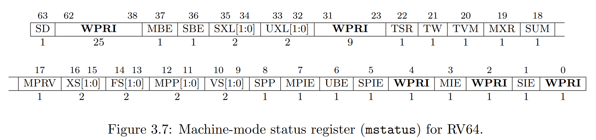
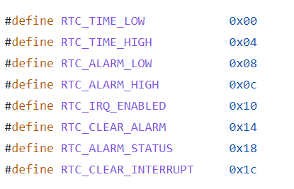

# Lab2

本实验所需源码可从 [lzu_oslab_exp 仓库](https://git.neko.ooo/LZU-OSLab/lzu_oslab_exp) 下载。

本实验的 step by step 文档可以访问 [Code an OS Project](https://lzu-oslab.github.io/step_by_step_doc/)。

## 目录结构

这一节我们介绍中断的开启、控制、设备的驱动与管理以及其他相关的内容。

从这一节开始，我们将对实验添加一定的目录结构，在这一节中所添加的目录结构如下：

- include: 包含了所有的头文件。头文件中主要是函数的定义、部分宏函数以及数据结构与常量的定义
- init: 包含了与启动相关的源代码，主要为汇编引导程序与“主”函数
- lib: 包含了编写系统时常用的函数等
- tools: 包含了代码生成、环境启动等需要的文件
- trap: 中断和驱动相关的代码主要就存放在这个目录内

同时，由于目录改变，`Makefile`文件的内容也须随之改变，`Makefile`内添加了对子文件夹的递归引用，以保证能完整编译所需要的所有文件。

## RISC-V 中断简单介绍

在实验二中，我们依然处于 S 态中，并不涉及 U 态。

在 RISC-V 中，异常分为两类。一类是同步异常(Exception)，这类异常在指令执行期间产生错误而导致的，如访问了无效的地址或执行了无效的指令。另一类是中断(Interrupt)，它是与指令流异步的外部事件，比如鼠标的单击，时钟的中断。其中，同步异常(Exception)是不可被屏蔽的（出现了错误 CPU 不能视而不见），而中断是可以屏蔽的（CPU 可以不理睬外设的请求）。

### CSR 寄存器

在 RISC-V 中，有八个重要的寄存器，叫控制状态寄存器（CSR），在 M 态分别是：

- mtvec（Machine Trap Vector）它保存发生异常时处理器需要跳转到的地址（它有两种模式，其中一种会使 CPU 在发生任一中断/异常时跳转到统一的内存地址，我们只使用这种模式）。
- mepc（Machine Exception PC）它保存异常发生时PC的值。
- mcause（Machine Exception Cause）它指示发生异常的种类。
- mie（Machine Interrupt Enable）它指示可处理和被忽略的中断。
- mip（Machine Interrupt Pending）它列出目前正准备处理的中断。
- mtval（Machine Trap Value）它保存了陷入（trap）的附加信息：地址例外中出错的地址、发生非法指令例外的指令本身，对于其他异常，它的值为 0。
- mscratch（Machine Scratch）它可以用于暂存一个字大小的数据。
- mstatus（Machine Status）它保存全局中断使能，以及许多其他的状态。

在不同的CPU特权级，寄存器的第一个字母更换成对应的不同特权级首字母即可。

对于 `mstatus` 寄存器的官方解释如下：



我们暂时只要关注其中的 MPIE、SPIE、MIE、SIE 这几位（分别位于 `mstatus` 的第7、5、3、1位）：xIE 代表某特权级的异常处理是否启用（1为启用），xPIE 会在中断发生时临时记录中断前 xIE 的值以便中断后恢复。

下面给出一张异常/中断的编号表，这张表与`mie`, `mip`, `mcause` 寄存器均有关联。

若 `mie` 与 `mip` 寄存器的**第N位**为1，则分别代表第N类中断不屏蔽、第N类中断发生。若这两个寄存器的第 N 位同时为1，表明第 N 类中断已经发生须处理，此时 CPU 就会去处理中断（若不考虑中断的优先级）。

在 `mcause` 寄存器中，最高位指示中断(Interrupt, 1)与同步异常(Exception, 0)，见下表最左列；其余位的**数字为N**（注意与`mie`, `mip` 寄存器的位表示法不同）表示发生的异常/中断是第N类。

|Interrupt|Exception Code|Description|
|:-:|:-:|:-|
|1|0|User software interrupt|
|1|1|Supervisor software interrupt|
|1|2|Reserved for future standard use|
|1|3|Machine software interrupt|
|1|4|User timer interrupt|
|1|5|Supervisor timer interrupt|
|1|6|Reserved for future standard use|
|1|7|Machine timer interrupt|
|1|8|User external interrupt|
|1|9|Supervisor external interrupt|
|1|10|Reserved for future standard use|
|1|11|Machine external interrupt|
|1|12–15|Reserved for future standard use|
|1|≥16|Reserved for platform use|
|0|0|Instruction address misaligned|
|0|1|Instruction access fault|
|0|2|Illegal instruction|
|0|3|Breakpoint|
|0|4|Load address misaligned|
|0|5|Load access fault|
|0|6|Store/AMO address misaligned|
|0|7|Store/AMO access fault|
|0|8|Environment call from U-mode|
|0|9|Environment call from S-mode|
|0|10|Reserved|
|0|11|Environment call from M-mode|
|0|12|Instruction page fault|
|0|13|Load page fault|
|0|14|Reserved for future standard use|
|0|15|Store/AMO page fault|
|0|16–23|Reserved for future standard use|
|0|24–31|Reserved for custom use|
|0|32–47|Reserved for future standard use|
|0|48–63|Reserved for custom use|
|0|≥64|Reserved for future standard use|

### 在 S 态中断/异常发生时CPU会做什么？

上面提到的都是 M 态的 CSR，而 S 态的 CSR 只是 M 态 CSR 的子集，结构相同，不再赘述，以下直接使用 S 态的 CSR 来说明。

中断发生有一个前提，`sstatus` 寄存器中 `SIE` 位为 1。`sie` 寄存器中某中断类的位为 1，此时若 `sip` 寄存器中对应中断类的位转为 1，则表明中断发生，CPU 要开始处理中断。若出现同步异常，CPU 会直接开始处理，与 `sie` 和 `sip` 无关（同步异常不可屏蔽）。

对于同步异常，大多是在指令执行过程中发生的，此时 pc 指向正在执行的指令；对于中断，只有在一条指令执行完到下一条指令执行前 CPU 才会检查是否有中断需要响应，此时 pc 指向下一条指令。

处理例外时，发生例外的指令的 pc 被存入 `sepc`，且 PC 被设置为 `stvec` 寄存器中存入的值。`scause` 根据异常类型自动被设置，`stval` 被设置成出错的地址或者其它特定异常的信息字。随后 `sstatus` 中的 `SIE` 置零，屏蔽中断，且 `SIE` 原值被保存在 `SPIE` 中。发生例外时的特权级被保存在 `sstatus` 的 `SPP` 位，然后设置当前特权级为 S 态(假设该中断已被委托给 S 态处理)。

因为此时 pc 已经被设成了 `stvec` 寄存器中存入的值，对应的是中断处理程序的地址，因此下一条指令就是中断处理程序的第一条指令，中断处理开始。

### 拓展：中断委托

常规情况下，每次发生中断，CPU 需要切换至更高一级特权级来处理，然而在很多时候我们在 S 态（实验1、2均在 S 态下执行）发生的中断并没有切换到 M 态（SBI 所在的特权级）处理，这是为什么呢？

原因是在SBI初始化过程中，默认设置了两个寄存器：`MIDELEG`（M 态中断委托）与 `MEDELEG`（M 态异常委托），这两个寄存器的每一位与上面提到的表所对应（表中 Interrupt 分别取 1 和 0），若寄存器某位为 1，则表明这一中断/异常被直接委托给 S 态处理，无需进入 M 态处理，这样就避免了特权级切换带来的额外开销。

## 项目实现讲解

### 开启中断

`main` 函数中调用的 `trap_init()` 函数的作用是初始化中断。

我们的中断处理程序入口由汇编语言写成，代码位于 `trapentry.s` 文件中，入口的标记是 `__alltraps`， 因此在 `trap_init` 函数中我们直接引入外部函数 `__alltraps`，用其地址设置 `stvec` 寄存器的值，随后将 `sstatus` 寄存器中 SIE 位置 1，中断就开启了。

### 处理中断

中断处理函数是 `trapentry.s` 文件中的 `__alltraps`，主要作用就是保存当前所有寄存器的值到栈内。保存时存储结构与 `trap.h` 中定义的结构体 `trapframe` 相对应，便于后续我们在C语言中直接使用结构体来操作栈。

随后使用 `jal trap` 指令跳转到 `trap.c` 文件中的 `trap` 函数处理。我们用汇编指令 `mv a0, sp` 为 `trap` 函数传入了一个参数（C语言函数的第一个传入参数保存在寄存器a0）中，即当前的栈指针。

进入 `trap` 函数后就正式开始处理中断。此处中断处理函数可以自行编写，实验2中的代码主要任务就是根据不同的中断/异常类型分配不同的处理方法。

在 `trap` 函数结束后PC会回到 `jal trap` 后的下一条指令（这个操作由编译器在编译时自动添加相关指令），随后恢复上下文（即保存在栈内的所有寄存器），随后退出中断处理程序，返回中断前的PC位置。

### 断点异常

断点异常（Breakpoint）是 RISC-V 中的一类同步异常。

断点异常触发方式非常简单，汇编指令是 `ebreak`，C语言内嵌汇编只需要写 `__asm__ __volatile__("ebreak \n\t");` 即可，便于我们测试中断处理程序的总体流程。

注意：断点异常属于同步异常，不可被屏蔽，因此无论中断是否开启均会被 CPU 响应，但要处理仍需设定 `stvec` 寄存器。

随后在中断处理程序 `trap` 及 `exception_handler` 中根据栈中保存的 `scause` 寄存器中的值来判断是否为断点异常，并对其做出处理：

```c
kputs("breakpoint");
print_trapframe(tf);
tf->epc += 2;
break;
```

即打印一条信息，随后打印当前的上下文信息，最后让中断处理结束后的pc+2（RISC-V中大多数指令是4字节长度，但GCC默认开启压缩指令，会导致一部分指令的长度为2字节，这里 `ebreak` 指令就是2字节长的指令）。

### 时钟中断

时钟中断（timer interrupt）属于可屏蔽的中断，默认是被屏蔽的，因此除了要在中断处理函数中做相应的处理，还需要额外开启时钟中断的处理。

因此在函数 `clock_init()` 中，我们将 `SIE` 寄存器的对应位置1，开启了时钟中断。

麻烦的是，RISC-V中的时钟中断不是设置了一次启动就一劳永逸的，每次时钟中断发生时，都需要重新设置下一次时钟中断的发生时间。因此我们额外编写了 `clock_set_next_event` 函数，设置下一次时钟发生的时间为当前时间加上一定的间隔(timebase)。这一函数需要在初始化时执行，也需要在每次时钟中断发生时再次执行。

注：QEMU 的时钟频率为 10MHz，设置timebase = 100000表示时钟中断频率为100Hz，即每秒发生100次时钟中断。

中断处理函数并不复杂，除了与断点异常相同的部分外，区别在于对时钟中断的特殊处理：首先设定下一次中断发生时间，随后每发生100次（PLANED_TICK_NUM）中断，将输出一次中断计数，10次计数后关机。

```c
clock_set_next_event();
if (++ticks % PLANED_TICK_NUM == 0) {
    kprintf("%u ticks\n", ticks);
    if (++ticks / PLANED_TICK_NUM == 10){
        sbi_shutdown();
    }
}
break;
```

### 外设驱动

除 CPU 与内存外，外部设备也是计算机的重要组成部分，例如本实验中计时是通过外部实时时钟（RTC）实现的，不依靠 CPU 的内部时钟，而输入输出也是通过 UART（串口通信）实现的。针对不同的外设需要编写不同的驱动程序以正确地使用它们。

#### 驱动抽象

在本项目中我们会对设备驱动做一定程度的抽象，以下以 RTC 驱动为例进行说明。

在 `trap/rtc` 目录中除了有针对特定硬件编写的 `rtc_goldfish.c`(QEMU) 与 `rtc_sunxi.c`(全志 D1) 外，还有与系统其他模块对接的抽象接口 `rtc.c`。

此外还有 `include` 目录中的 `rtc.h` 存放相关抽象数据结构与一些常量定义、抽象设备的函数声明。

在 `rtc.h` 中：

- `struct rtc_class_ops` 包含了 RTC 类的操作函数的指针，包括读写时间、读写下一次中断时间、中断处理与取消下次中断等。
- `struct rtc_class_device` 包含了 RTC 类设备的必要信息，包括设备 ID 与操作函数指针。
- `goldfish_rtc_init` 与 `sunxi_rtc_init` 函数声明用于 `rtc.c` 中初始化调用具体设备驱动程序进行初始化。
- 其余的函数声明均为可被其他系统模块调用的抽象设备操作函数。

在 `rtc.c` 中：

- `rtc_probe` 函数用于通过解析设备树(见 `dtb.c`)后生成的硬件信息探测当前硬件平台拥有的 RTC 设备型号。
- `rtc_init` 用于调用 `rtc_probe` 后挂载对应的驱动程序
- 其余函数通过调用 `struct rtc_class_device` 中的函数指针完成具体设备的对应操作。
- 全局变量 `struct rtc_class_device rtc_device` 具体定义了当前系统使用的 RTC 设备及其操作函数，它会在 `rtc_init` 中被填写，以此来建立抽象设备与具体设备的桥梁。

在 `rtc_goldfish.c`(QEMU RTC 驱动)中：

- `goldfish_rtc_read_time`, `goldfish_rtc_set_time`, `goldfish_rtc_read_alarm`, `goldfish_rtc_set_alarm`, `goldfish_rtc_interrupt_handler`, `goldfish_rtc_clear_alarm` 均为 RTC 设备的具体操作函数，与 `struct goldfish_rtc_ops` 中的函数指针一一对应。
- `goldfish_rtc_init` 函数由 `rtc.c` 中的 `rtc_init` 函数调用，将具体 RTC 操作赋值给 `rtc.c` 中的全局变量 `struct rtc_class_device rtc_device`。

在系统初始化过程中，`main` 函数调用 `unflatten_device_tree(dtb_start)` 解析设备树，获取当前硬件平台所使用的设备信息，随后调用 `rtc_init()` 获取针对 RTC 设备的信息并选择合适的驱动程序初始化，将对应驱动程序的具体操作函数指针写入全局变量 `struct rtc_class_device rtc_device` 中。

在操作系统其他模块中，直接调用 `read_time()` 等抽象 RTC 设备的操作函数，这些函数会通过调用全局变量 `struct rtc_class_device rtc_device` 中存放的具体操作函数实现具体 RTC 设备的对应功能。

#### 寄存器数据结构设计

注意：这里的寄存器特指硬件的**端口**。

RISC-V 采用内存统一编址方案，外设的端口也用特定的内存地址表示，对某一特定的内存地址进行读写即对该硬件端口进行读写。

同样以 goldfish RTC 为例，根据 [QEMU 的源码](https://github.com/qemu/qemu/blob/master/hw/riscv/virt.c#L77)可知，RTC 端口的起始地址在物理地址的 `0x101000` 处。

根据 [QEMU 源码](https://github.com/qemu/qemu/blob/master/hw/rtc/goldfish_rtc.c)可知 goldfish RTC 各个功能端口相对于起始地址的偏移如下：



在代码中我们使用结构体 `struct goldfish_rtc_regs` 来表示这些寄存器偏移，使结构体成员变量在内存中的布局与硬件端口相对起始地址的偏移的布局一致。随后将硬件的起始地址强制类型转换后赋值给 `struct goldfish_rtc_regs *` 结构体指针变量，这样就可以通过结构体中每个成员变量的偏移来表示硬件的对应端口了。

```c
struct goldfish_rtc_regs {
	// time 先读低32位 https://github.com/qemu/qemu/blob/v6.2.0-rc2/hw/rtc/goldfish_rtc.c#L106-L113
	// alarm 先写高32位 https://github.com/qemu/qemu/blob/v6.2.0-rc2/hw/rtc/goldfish_rtc.c#L154-L160
	uint32_t time_low; //0x00   R/W: 低32位时间
	uint32_t time_high; //0x04  R/W: 高32位时间
	uint32_t alarm_low; //0x08  R/W: 低32位闹钟
	uint32_t alarm_high; //0x0c R/W: 高32位闹钟
	uint32_t irq_enabled; //0x10    W: 启用中断
	uint32_t clear_alarm; //0x14    W: 清除闹钟
	uint32_t alarm_status; //0x18   R: 闹钟状态(1:闹钟有效)
	uint32_t clear_interrupt; //0x1c W: 清除中断
};

volatile struct goldfish_rtc_regs *rtc =
    (volatile struct goldfish_rtc_regs *)0x101000;
```

这样在使用时只需通过对 `rtc -> REG_NAME` 进行读写操作即可。

#### 平台级中断控制器（PLIC）

由外部硬件产生的中断属于外部中断(external interrupt)。在 RISC-V 中，所有的外部中断都由一个叫平台级中断控制器（PLIC）的设备发起，而它则会接收外设对它发起的中断，这相当于 CPU 将外设的中断委派给 PLIC 管理与仲裁。

外设中断基本流程：

```
外设 --- X 号中断 ---> PLIC --- external interrupt 中断 ---> CPU
CPU --- 请求获取中断号 X ---> PLIC
PLIC --- 中断号 X ---> CPU
CPU --- 合适的驱动控制 ---> 外设
```

对于 PLIC 也有很多参数可供设置，如中断的使能、各中断的优先级与屏蔽与否、响应中断的优先级阈值等。

具体使用方法请参考 [PLIC 规范](plic.md)。

#### 实时时钟（RTC）

除了 CPU 时钟之外，通常的硬件平台都会有额外的 RTC 组件用以记录当前的现实时间，它们通常还能用作计时器来触发中断。

QEMU virt 平台模拟了一款名叫 goldfish 的 RTC 硬件。关于 goldfish 的使用请参考 [QEMU 源码](https://github.com/qemu/qemu/blob/master/hw/rtc/goldfish_rtc.c)。

根据 [QEMU 源码中对 virt 平台的定义](https://github.com/qemu/qemu/blob/v6.2.0-rc2/include/hw/riscv/virt.h#L69)，RTC 的中断号是 11。

#### 通用非同步收发传输器（UART，串口通讯）

在我们的系统中并没有编写显示相关的驱动和键盘驱动，因此系统实际运行时也没有采用虚拟/真实显示器展示运行结果，而是通过文本的方式展示，其背后依靠的是串口通信。QEMU 虚拟机运行时有一个串口模式，在终端中不带 GUI 运行时，QEMU 默认显示的就是它的串口模式，此模式下的按键可以通过虚拟机的某一特定串口（UART0）传给虚拟机，同时虚拟机操作系统也可以通过该串口输出文本（或控制字符），QEMU 串口界面就会对其进行展示。

在我们编写 UART 驱动之前就可以使用串口通信，是因为 OpenSBI 内就有相关的驱动为我们提前设置了硬件的参数，在进入 S 态操作系统后若不进行修改，则会继续沿用。

根据设备树信息可知 QEMU virt 平台模拟 UART 硬件（串口通信所用硬件）与 ns16550a 兼容。关于 ns16550a 的使用请参考 [Serial UART information](https://www.lammertbies.nl/comm/info/serial-uart)。

```
// QEMU Device Tree
uart@10000000 {
    interrupts = <0x0a>;
    interrupt-parent = <0x03>;
    clock-frequency = "\08@";
    reg = <0x00 0x10000000 0x00 0x100>;
    compatible = "ns16550a";
};
```

根据 [QEMU 源码中对 virt 平台的定义](https://github.com/qemu/qemu/blob/master/include/hw/riscv/virt.h#L85)，UART0 的中断号是 10。

## 实验内容

1. 请将你在 Lab1 中填充的代码复制到 Lab2 中：
    - Lab1 中 `entry.s` 对应 Lab2 的文件为 `init/entry.s`
    - Lab1 中 `sbi.c` 对应 Lab2 的文件为 `lib/sbi.c`
2. 根据上述解析与参考文档，补全以下文件中的代码，使得系统启动后运行的打飞机游戏可正常执行（使用 WASD 键控制方向，使用空格发射子弹）：
    1. trap.c 中的 `external_handler` 函数
    2. uart_qemu.c 中的 `uart_16550a_read`, `uart_16550a_directly_write`, `uart_16550a_putc`, `uart_16550a_interrupt_handler` 函数
3. 在系统初始化时修改 RTC 时间为当前现实时间，并在每次游戏画面刷新时将当前时间(HH:mm:ss)显示在屏幕上。
4. 回答以下问题：
    1. 为什么我们在中断处理时要保存和恢复所有的寄存器？
    2. 为什么断点异常处理需要在结束时让 pc 加 2 而时钟中断不需要？
    3. 通过开机时读取 SBI 的输出信息或调试时查看特定寄存器可以知道哪些中断/异常被委托到 S 态处理了，请列出所有被委托的中断/异常。
    4. 当向虚拟机中输入一个字符或按下一个按键时，操作系统会发生什么？请详细描述这一过程并画出函数调用链。
5. 拓展任务：
    1. 本章实验内容有何缺陷与可改进之处？
