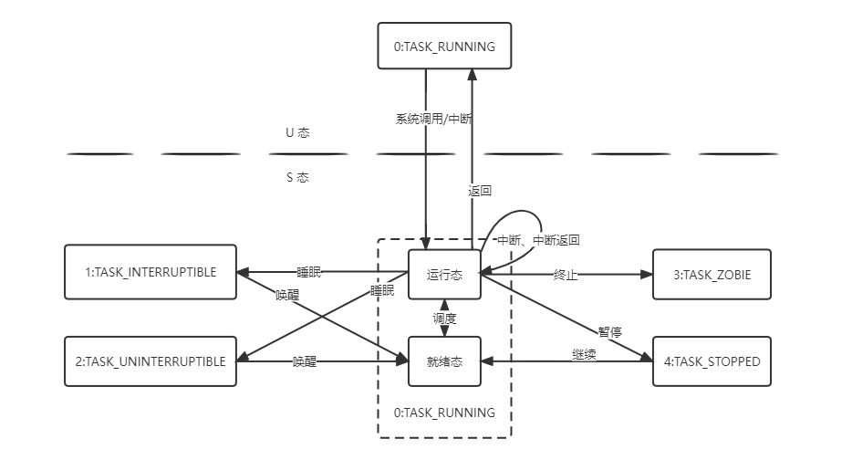
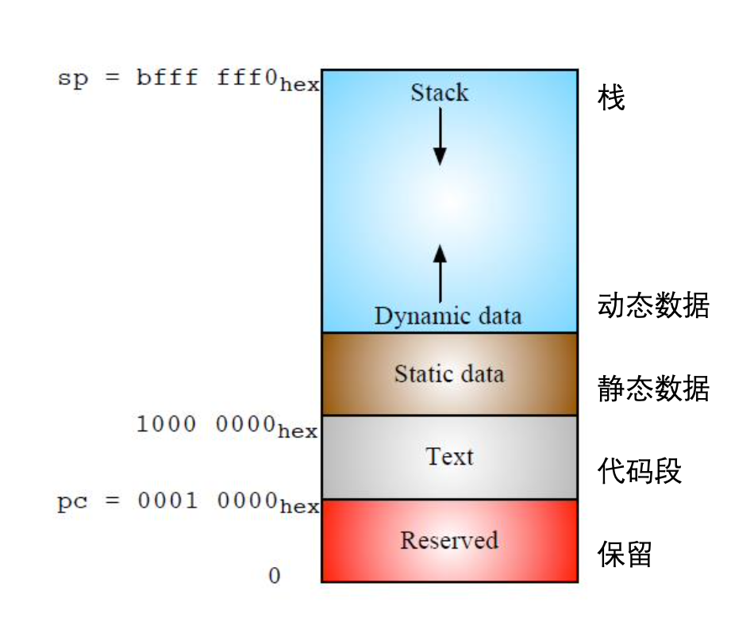

# Lab5

本实验所需源码可从 [lzu_oslab_exp 仓库](https://git.neko.ooo/LZU-OSLab/lzu_oslab_exp) 下载。

本实验的 step by step 文档可以访问 [Code an OS Project](https://lzu-oslab.github.io/step_by_step_doc/)。

这一节，我们将涉及到特权级切换、进程 0 的创建、fork、进程调度与切换、系统调用、进程睡眠与唤醒等。

## 进程控制块

每个进程都有*进程控制块*（*Process Control Block*），这个数据结构包含描述、控制该进程的全部信息，如调度优先级、进程 ID 、处理器状态等。在本实验中，进程控制块被实现为结构体 `struct task_struct`：

```c
/** 进程控制块 PCB(Process Control Block) */
struct task_struct {
    uint32_t uid;  /* 用户ID */
    uint32_t euid; /* 有效用户ID */
    uint32_t suid; /* 保存的设置用户id */
    uint32_t gid;  /* 组id */
    uint32_t egid; /* 有效组id */
    uint32_t sgid; /* 保存的设置组id */

    uint32_t exit_code;           /**< 返回码 */
    uint32_t pid;                 /**< 进程 ID */
    uint32_t pgid;                /**< 进程组 */
    // uint64_t start_code;          /**< 代码段起始地址 */
    // uint64_t start_rodata;        /**< 只读数据段起始地址 */
    uint64_t start_data;          /**< 数据段起始地址 */
    uint64_t end_data;            /**< 数据段结束地址 */
    uint64_t brk;                 /**< 堆结束地址 */
    // uint64_t start_stack;         /**< 栈起始地址 */
    // uint64_t start_kernel;        /**< 内核区起始地址 */
    uint32_t state;               /**< 进程调度状态 */
    uint32_t counter;             /**< 时间片大小 */
    uint32_t priority;            /**< 进程优先级 */
    struct vfs_inode *fd[4];
    struct task_struct *p_pptr;   /**< 父进程 */
    struct task_struct *p_cptr;   /**< 子进程 */
    struct task_struct *p_ysptr;  /**< 创建时间最晚的兄弟进程 */
    struct task_struct *p_osptr;  /**< 创建时间最早的兄弟进程 */
    uint32_t utime,stime;         /**< 用户态、内核态耗时 */
    uint32_t cutime,cstime;       /**< 进程及其子进程内核、用户态总耗时 */
    size_t start_time;            /**< 进程创建的时间 */
    uint64_t *pg_dir;             /**< 页目录地址 */
    union {
        struct {
            uint64_t vaddr;         // Clock 调度算法中上次搜到了哪个虚拟地址
        } clock_info;
    } swap_info;
    context context;              /**< 处理器状态，请把此成员放在 PCB 的最后 */
};
```

进程虚拟地址空间被划分为多个段，每段的起始结束不是固定的，`struct task_struct` 中使用 `start_data` 等来记录各段虚拟地址空间范围。

PCB 中另外两个有重要意义的字段是 `context` 和 `pg_dir`。`context` 保存处理器状态，包括通用寄存器、`stval`、`sstatus`、`sepc`、`badvaddr`、`scause` 寄存器等。有了`context`，系统才能保存处理器状态，实现进程的切换。`pg_dir` 指向进程的页目录，每个进程都有自己独占的页表，这保证了不同的进程有布局相同但独立的进程地址空间。

`context`定义如下：

```c
typedef struct trapframe context;                             /**< 处理器上下文 */

/**
 * @brief 保存通用寄存器的结构体抽象，用于trapframe结构体
 */
struct pushregs {
    uint64_t zero; // Hard-wired zero
    uint64_t ra;   // Return address
    uint64_t sp;   // Stack pointer
    uint64_t gp;   // Global pointer
    uint64_t tp;   // Thread pointer
    uint64_t t0;   // Temporary
    uint64_t t1;   // Temporary
    uint64_t t2;   // Temporary
    uint64_t s0;   // Saved register/frame pointer
    uint64_t s1;   // Saved register
    uint64_t a0;   // Function argument/return value
    uint64_t a1;   // Function argument/return value
    uint64_t a2;   // Function argument
    uint64_t a3;   // Function argument
    uint64_t a4;   // Function argument
    uint64_t a5;   // Function argument
    uint64_t a6;   // Function argument
    uint64_t a7;   // Function argument
    uint64_t s2;   // Saved register
    uint64_t s3;   // Saved register
    uint64_t s4;   // Saved register
    uint64_t s5;   // Saved register
    uint64_t s6;   // Saved register
    uint64_t s7;   // Saved register
    uint64_t s8;   // Saved register
    uint64_t s9;   // Saved register
    uint64_t s10;  // Saved register
    uint64_t s11;  // Saved register
    uint64_t t3;   // Temporary
    uint64_t t4;   // Temporary
    uint64_t t5;   // Temporary
    uint64_t t6;   // Temporary
};

/**
 * @brief 保存上下文的栈的结构体抽象，和trap.S中分配的36*XLENB相对应
 */
struct trapframe {
    struct pushregs gpr; // x0-x31 (general purpose register)
    uint64_t status;     // sstatus
    uint64_t epc;        // sepc
    uint64_t badvaddr;   // stval
    uint64_t cause;      // scause
};
```

### 内核堆栈

用户态进程有时需要调用内核的功能，这时进程会由用户态陷入到内核态，执行内核态的代码。为了避免用户态、内核态数据互相干扰导致错误，每个进程都会有自己的内核堆栈和用户堆栈。当进程在用户态运行时，当前堆栈为用户堆栈，切换到内核态时，堆栈也同时切换到内核堆栈。

在本实验中，将内核堆栈和进程 PCB 放置在同一物理页，其中 PCB 从该页低地址往高地址填充，而内核栈从该页高地址往低地址扩张。

```c
/**
 * @brief 进程数据结构占用的页
 *
 * 进程 PCB 和内核态堆栈共用一页。
 * PCB 处于一页的低地址，内核态堆栈从页最高地址到低地址增长。
 */
union task_union {
    struct task_struct task;                                  /**< 进程控制块 */
    char stack[PAGE_SIZE];                                    /**< 内核态堆栈 */
};
```

## 进程状态

本系统采用五状态模型，但与常见的五状态模型不同的是，本系统就绪状态与运行状态同为 TASK_RUNNING，没有独立的就绪态。同时将阻塞状态分为TASK_INTERRUPTIBLE 与 TASK_UNINTERRUPTIBLE 两种状态，分别对应不同的睡眠特性。

- TASK_RUNNING：运行状态
  - 我们将进程在处理器上运行或进程就绪等待处理的状态统一为此运行状态。当一个进程被创建，初始状态即设置为该状态，表示该进程就绪，等待被调入处理器运行。当进程在处理器中运行时，进程状态不发生改变，但会将全局变量 current 指向该进程的 PCB 以记录当前处理器执行的进程。
- TASK_INTERRUPTIBLE：可中断睡眠状态
  - 可中断睡眠状态是进程等待事件发生的状态。系统不会调度一个可中断睡眠状态的进程到处理器运行。进程状态变为可中断睡眠状态的原因可能是在等待分配资源，或是收到了其他进程发来的睡眠信号。当所需资源得到分配或收到唤醒信号，进程就从可中断睡眠状态转化为运行状态。
- TASK_UNINTERRUPTIBLE：不可中断睡眠状态
  - 不可中断睡眠状态使用在进程等待硬件条件的情况下。该状态与可中断睡眠状态基本是类似的，唯一的不同在于，处于不可中断睡眠状态的进程不会因收到唤醒信号而转化为运行状态，仅能通过所需资源得到分配后使用 wake_up() 函数才能完成这一转换。
- TASK_ZOMBIE：僵尸状态
  - 当进程退出时，将除 PCB 以外的其他资源全部释放完毕后，即置其进程状态为僵尸状态，保留进程的基础数据信息，等待父进程处理。
- TASK_STOPPED：暂停状态
  - 当一个子进程收到暂停信号，就会转化为暂停状态。只有收到暂停解除（SIGCONT）信号，该进程才会转化为运行状态。

这五种状态之间相互转换的关系与特权级切换时机如下图所示：



## 进程控制的相关数据结构

我们的操作系统内核维护了一个进程表，即数组 `struct task_struct* tasks[NR_TASKS]`。该数组定义在 `sched.c` 中，每个表项是指向进程的结构指针，即指向 `struct task_struct` 结构。此外，每个表项的数组下标记录为进程 ID（PID），以此保证 PID 没有重复。该数组大小 `NR_TASKS` 为 512.

此外，系统还维护有一个当前运行进程指针 `struct task_struct* current`，指向当前在处理器上运行的进程控制块。该指针作为全局变量定义在 `sched.c` 文件中，并初始化为 `NULL`。在 0 号进程创建后会先指向 0 号进程。

在进程调度上，我们采用了分时技术，即把 CPU 的运行时间进行切分，分为若干个时间片（time slice）。每个进程运行完自己的时间片后，系统就会切换至下一个进程运行。在单核的机器上，某一个时刻只能处理一个进程的信息。但由于限制了每个进程运行的时间片在一个很短的时间内，所以在用户看来，CPU 同时处理着多个进程。本内核中，分配给进程的时间片的数量是可变的，存放于进程 PCB 中的 `counter` 变量中，单位是“系统滴答数”(ticks)。

## 系统调用

从用户态主动进入内核态的方式就是通过系统调用进行。它在指令集层面的实现原理是在 U 态发出 `ecall` 指令，这时 CPU 会收到一个 `CAUSE_USER_ECALL` 异常，进入内核态处理异常。

系统调用可以有不定长的参数，参数可以使用寄存器传递，返回值也是用寄存器传递，具体可查看 [RISC-V ABI 规范](https://github.com/riscv-non-isa/riscv-elf-psabi-doc)，因此一个系统调用的入口函数可以写成这样：

```c
/**
 * @brief 通过系统调用号调用对应的系统调用
 *
 * @param number 系统调用号
 * @param ... 系统调用参数
 * @note 本实现中所有系统调用都仅在失败时返回负数，但实际上极小一部分 UNIX 系统调用（如
 *       `getpriority()`的正常返回值可能是负数的）。
 */
int64_t syscall(int64_t number, ...)
{
    va_list ap;
    va_start(ap, number);
    int64_t arg1 = va_arg(ap, int64_t);
    int64_t arg2 = va_arg(ap, int64_t);
    int64_t arg3 = va_arg(ap, int64_t);
    int64_t arg4 = va_arg(ap, int64_t);
    int64_t arg5 = va_arg(ap, int64_t);
    int64_t arg6 = va_arg(ap, int64_t);
    int64_t ret = 0;
    va_end(ap);
    if (number > 0 && number < NR_TASKS) {
        /* 小心寄存器变量被覆盖 */
        register int64_t a0 asm("a0") = arg1;
        register int64_t a1 asm("a1") = arg2;
        register int64_t a2 asm("a2") = arg3;
        register int64_t a3 asm("a3") = arg4;
        register int64_t a4 asm("a4") = arg5;
        register int64_t a5 asm("a5") = arg6;
        register int64_t a7 asm("a7") = number;
        __asm__ __volatile__ ("ecall\n\t"
                :"=r"(a0)
                :"r" (a1), "r" (a2), "r" (a3), "r" (a4), "r" (a5), "r" (a7)
                :"memory");
        ret = a0;
    } else {
        panic("Try to call unknown system call");
    }
    if (ret < 0) {
        errno = -ret;
        return -1;
    }
    return ret;
}
```

同样的，我们还需在中断处理程序中添加对 `CAUSE_USER_ECALL` 异常的处理，只需在原有的 `exception_handler` 函数内修改。可以直接调用一个新函数：

```c
case CAUSE_USER_ECALL:
    return syscall_handler(tf);
    break;
```

随后在 `syscall_handler` 函数中分派至不同的系统调用处理函数：

```c
/**
 * @brief 系统调用处理函数
 *
 * 检测系统调用号，调用响应的系统调用。
 * 当接收到错误的系统调用号时，设置 errno 为 ENOSY 并返回错误码 -1
 */
static struct trapframe* syscall_handler(struct trapframe* tf)
{
    uint64_t syscall_nr = tf->gpr.a7;
    if (syscall_nr >= NR_syscalls) {
        tf->gpr.a0 = -1;
        errno = ENOSYS;
    } else {
        tf->gpr.a0 = syscall_table[syscall_nr](tf);
    }
    tf->epc += INST_LEN(tf->epc); /* 执行下一条指令 */
    return tf;
}
```

## 初始化进程“0”

所有用户进程都是从 0 号进程 fork 出来的，它们的 PCB 都是从进程 0 中复制而来，因此进程 0 的构建至关重要。

创建进程 0 需要首先手动构建 0 号进程所需的相关数据，其中最主要的就是进程 0 的 PCB。初始化 0 号进程的过程就是创建一个 `struct task_struct` 结构体，将进程 0 的一部分必要信息填入，然后将内核移入这个进程。为避免函数结束后局部变量的生命周期结束，进程 0 的 PCB 可以以全局变量的形式存放，将其变量名命名为 `init_task`。构造进程 0 的 PCB 主要进行了以下操作：

1. 以全局变量形式创建一个空的 struct task_struct 结构体 init_task；
2. 将 tasks[0] 指向 0 号进程的 init_task 地址；
3. 清空 tasks[] 数组除 0 号进程的所有项（这个操作是较为严谨的做法）；
4. 设置 0 号进程 init_task 中的状态、优先级、内存信息等基础信息；
5. 将当前进程指针 current 设置为 0 号进程 init_task。

创建完进程 0 的相关数据结构并切换到进程 0 之后，需要将特权级切换至 U 态，这一过程通过 `init_task0()` 宏伪造中断发生的方法来实现。

从用户态主动进入内核态的方式之一是系统调用。它在指令集层面的实现原理是在 U 态发出 `ecall` 指令，这时处理器会收到一个 `CAUSE_USER_ECALL` 异常，进入 S 态处理异常，中断返回后可以重回 U 态。

假设处理器正运行在用户态。此时通过 ecall 指令陷入内核态请求一个系统调用，这时候处理器会自动将部分寄存器改写：

- scause: 被设置成 `CAUSE_USER_ECALL`
- sstatus:
  - SPP 位设为发生异常之前的权限模式（0，表示 U 态）
  - SIE 位置 0 以禁用中断
  - SPIE 位被设置为原 SIE 位的值（1，开）
- sepc: 被设置为异常发生时的 pc 值
- pc: 被设置为 stvec(即 `__alltraps`，中断处理程序入口，见 Lab2)

伪造一个从用户态发出的系统调用，就需要伪造上述 CSR 的变化。此外，由于系统调用至少需要一个参数提供调用号，而这里不是通过真正执行 `syscall()` 函数进入系统调用的，因此也需要伪造这个参数，此外还需要提前写好一个系统调用处理函数，并绑定系统调用号（0号）。

可以直接将值写入各寄存器后用 call 指令跳转至中断处理入口 `__alltraps` 处以模拟这一系统调用中断过程。在 `__alltraps` 中，处理器当前的上下文（包括所有32个通用寄存器与 `sstatus`、`sepc`、`stval`、`scause` 4个控制状态寄存器）将会作为一个 `struct trapframe` 结构体 `tf` 被保存到栈中，以便将来的中断处理程序调用其中的数据与中断结束后的现场恢复。

在进入 0 号系统调用后，主要完成与进程 0 内存相关的部分，如新页表的映射与启用、用户栈的分配。

由于并没有实际上的 0 号进程的用户代码和数据，因此可以将内核的代码和数据映射至用户程序的内存空间，当做 0 号进程的代码和数据使用。根据内核编译的链接脚本 `linker.ld` 文件，内核的代码与数据主要分为四段，其内存地址范围与权限说明如下：

|起始地址|结束地址|权限(用户态)|
|-|-|-|
|代码段(text)|text_start|rodata_start|只读、执行|
|只读数据段(rodata)|rodata_start|data_start|只读|
|数据段(含data与bss段）|data_start|kernel_end|读、写|

这里仅仅是把内核的代码和数据充当进程 0 的代码和数据，并不取消原内核内存空间的映射，也不复制数据到新的物理页。相当于两个虚拟地址映射到同一段物理地址上，因此在新映射建立后物理页在 `mem_map[]` 数组中的引用计数需要加 1。这一过程使用 `put_page()` 函数协助完成映射。



参考上图 *RISC-V Reader* 中的地址空间布局，我们将每个进程的的地址空间布局定义为如下布局：

```c
/** 
 * 进程拥有 4G 虚拟地址空间，并被划分成多个段，布局如下：
 * 0xFFFFFFFF----->+--------------+
 *                 |              |
 *                 |              |
 *                 |    Kernel    |
 *                 |              |
 *                 |              |
 * 0xC0000000----->---------------+
 *                 |    Hole      |
 * 0xBFFFFFF0----->---------------+
 * (START_STACK)   |    Stack     |
 *                 |      +       |
 *                 |      |       |
 *                 |      v       |
 *                 |              |
 *        brk----->+--------------+
 *                 |      ^       |
 *                 |      |       |
 *                 |      +       |
 *                 | Dynamic data |
 *   end_data----->+--------------+
 *                 |              |
 *                 |    .bss      |
 *                 |    .data     |
 *                 |              |
 * start_data----->+--------------+
 *                 |              |
 *                 |    .rodata   |
 *                 |    .text     |
 *                 |              |
 * 0x00010000----->---------------+
 *                 |   Reserved   |
 * 0x00000000----->+--------------+
 *
 * 段与段之间不一定是相连的，中间可能存在空洞。
 */
```

在用户内存空间映射完成后，从系统启动至今会有如下表所示的三个地址空间：

| | |起始地址|结束地址|
|-|-|-|-|
|物理地址空间|系统部分|0x80000000|0x80000000+物理内存大小|
|进入用户态之前的内核虚拟地址空间|系统部分|0xC0000000|0xC0000000+物理内存大小|
|进入用户态之后的|用户内存空间|0x10000|0xC0000000|
|进程虚拟地址空间|内核内存空间(系统部分)|0xC0000000|0xC0000000+物理内存大小|

随后需要分配一页空间作为进程的用户态栈，刷新 TLB，并将地址存于 sp 寄存器的现内核态栈的数据复制过去，最后将**上下文中**的栈指针 sp 与 s0 设置为用户栈地址，这样返回用户态时恢复上下文后就能使用新的用户栈了。

完成这些任务后，将“伪”中断中保存的上下文数据存入 task_struct 结构中的 context 内，以备后续 switch_to() 函数使用。

根据定义，栈顶从 0xBFFFFFF0 开始向低地址扩展，因此需要在虚拟地址 `0xBFFFFFF0 - PAGE_SIZE` 处申请新页，用户栈的权限需要设置为用户态可读可写。这一过程使用 `get_empty_page()` 函数完成。

值得注意的是，sp 理论上不能仅简单设置为 START_STACK(0xBFFFFFF0)，因为从内核栈复制过来的用户栈已经有有用的数据，例如局部变量，新的内容不能将原有数据覆盖，而是需要在原有数据基础上收缩或者扩张栈，需要使用原 sp 加上用户栈到初始栈的偏移量。

同样需要注意的是这里参与计算的 sp 值不能是当前 sp 寄存器的值，因为在进入“伪”中断后 sp 由于需要存放上下文被修改过，内核栈在中断返回时会被恢复，但 tf 中的手动修改的用户栈并不会，这样回到用户态后栈上会有多余的“伪”中断时的保存的上下文。

GCC 使用 s0 寄存器来查找栈上的局部变量，它指向当前栈帧起始地址（高地址），和 sp 一样需要加上用户栈到初始栈的偏移量来使用户态程序能在用户栈中查找局部变量。

另外还需注意，复制过来的用户栈中有函数调用信息，但是里面的返回地址（绝对地址）在内核区，用户态无法访问，因此函数调用信息不可被使用。

在完成 0 号系统调用后，CPU 通过 sret 指令根据伪造的中断进入了用户态进程 0，继续执行 main 函数中的语句。

## fork函数——进程的创建

0 号进程以外的所有进程都是使用 fork 函数创建出来的。也就是说，操作系统正常运行时，所有进程都是 0 号进程的子进程。

在创建新进程的过程中，系统会：

1. 在任务数组中找出一个还没有被任何进程使用的空项（其下标就是 PID）将该 PID 指定给要新建的进程并创建 PCB 页
2. 复制当前进程 PCB 中的所有内容至新进程 PCB
3. 将新进程状态置为 TASK_UNINTERRUPTIBLE 状态防止这个还未处理完成的新建进程被调度函数执行
4. 修改新进程 PCB 中的 PID、优先级、时间片大小等信息
5. 将进程状态置为 TASK_RUNNING 状态
6. 返回新建进程的 PID 至父进程，通过修改进程 PCB 中存储的上下文返回 0 至新进程。

## 进程的睡眠和唤醒

进程的睡眠主要的操作是当进程得不到需要的资源（资源被占用或不在内存中），将进程状态修改为不可中断睡眠状态，并调用调度算法使 CPU 执行其他进程。同时，用一个临时指针记录该进程，当该进程收到唤醒信号要被唤醒时，将其状态修改回 TASK_RUNNING（就绪状态）等待被调度运行。

本系统的实现中，进程阻塞队列没有使用真正的队列数据结构，而是利用多个因等待同一事件发生而阻塞进程各自的内核栈中的临时变量实现的，是一种依托于不同进程的栈的栈上队列。

阻塞事件的函数中仅有一个指向进程 `task_struct` 指针的指针，它指向队列头进程。而队列头进程在被阻塞时，其内核栈上的 `sleep_on()` 函数的栈帧中又有一局部变量存放了原阻塞队列队头的进程指针，并用自己的 `task_struct` 指针替换了原阻塞队列队头进程的 `task_struct` 指针，成为新的队列头进程。

进程唤醒主要的操作是修改了进程的状态信息，即将可中断睡眠状态或不可中断睡眠状态的进程修改为运行状态。进程唤醒后有机会被调度算法执行，随后恢复到被换出前的上下文，即 `sleep_on()` 函数中继续向下执行。若自身并非阻塞队列头进程，则将现阻塞队列头进程唤醒。若自身是阻塞队列头进程，将原阻塞队列头进程唤醒。按照这样的唤醒链可以将阻塞队列上的所有队列从头到尾（从最后被阻塞的进程到最先被阻塞的进程）按顺序依次唤醒。

这样的链式唤醒也导致了被唤醒进程不能保证等待事件如实发生，进程被唤醒后需要由原阻塞事件处理函数再次检查条件来确定是否需要重新阻塞。

`wake_up()` 函数由被阻塞进程等待发生的事件调用，实现较为简单，只需要将指定阻塞进程队列头进程的状态(`*p->state`)改为 `TASK_RUNNING` 即可。

## 进程的退出

进程可以通过 `NR_exit` 系统调用来退出。当系统调用发生时，会调用 `sys_exit()` 函数将当前进程的 PID 与退出码传递给 `exit_process()` 函数。`exit_process()` 函数首先须释放当前进程的代码段和数据段所占用的内存页面，随后通过 PCB 中父进程指针通知父进程，向父进程发送子进程终止信号 SIGCHLD。

如果当前进程有子进程，就将子进程的父进程字段置为 1，将子进程交给进程 1(init进程)代为托管；如果该子进程已经处于僵死状态，则代子进程向进程 1 发送子进程终止信号 SIGCHLD。

在此之后，设置当前进程状态为 `TASK_ZOMBIE`，并设置退出码 `exit_code` 为传参进来的退出码，最后调用 `schedule()` 调取下一个进程。

当进程的父进程收到 SIGCHLD 信号后，将会检查子进程的退出码等信息，并释放子进程的所有剩余资源（本系统中只有 PCB 所占用的内存资源），销毁子进程，彻底结束子进程的生命周期。

在 Lab5 中因暂未完成信号等功能，我们暂时不考虑资源的释放，仅完成进程状态与退出码的设置和新进程的调度，以便于进程调度的测试。

## 进程的调度

进程调度是操作系统管理处理器资源的最基本方式，操作系统通过暂停等待事件发生的进程运行，转而运行另一已就绪的进程，以使处理器有更高的利用率，而通过暂停长时间运行的进程运行，转而运行其他进程，可以避免其他进程长期无法得到处理器资源，以保证用户交互的及时响应与进程之间运行的公平和效率，如何选择下一个被执行的进程就是调度算法的工作。良好的进程调度或者可以提高吞吐量，或者可以降低周转时间，或者可以减少响应周期，或者可以做到其中多项，但无法满足所有对性能的需求。因此采用怎样的调度算法的设计体现了设计者对各项性能指标的取舍与权衡。

调度算法有两种决策模式，一种是非抢占式的调度算法，正在运行的进程除非执行完毕或因某事件阻塞，否则不会被暂停；另一种是抢占式的调度算法，可以在某一事件发生时（如时间片耗尽、新进程到达）暂停当前正常执行的进程，转而执行就绪的另一进程。后者虽然有查找与切换进程的开销，但实际上可以获得更佳的计算机使用体验，避免某一进程长期独占处理器资源。

教学上常见的调度算法种类繁多，但在实际应用中，往往不能预先给出各个进程相对运行时长的信息，此时SPN、SRT与HRRN算法就无法使用。

接下来我们会介绍本节实现的4种调度算法，分别是先来先服务调度算法、时间片轮转算法、基于优先级的时间片轮转调度算法、多级反馈队列调度算法。其中，第一种调度算法是非抢占式的，而后两种调度算法则是基于时间片轮转的抢占式调度方法。时间片是依靠处理器内部时钟产生的时钟中断实现的（详见 Lab2 中的时钟中断）。

### 发生调度之前

调度通常会在进程退出、进程被阻塞或进程时间片到期时发生。

RISC-V 的处理器可以设置下一次时钟中断发生的时刻，若每一次时钟中断发生的间隔相同，就可以产生固定频率的时钟中断。每一次时钟中断发生时，在系统的时钟中断处理程序中，可以检查当前运行在 CPU 的进程的剩余时间片大小，判断其时间片是否用完。如果当前进程的剩余时间片已经用完，则调用进程调度函数，按照调度算法找出下一个就绪进程，修改 current 指向该进程，并切换至新进程的上下文，将其放到 CPU 上运行，否则减少当前进程的剩余时间片。这一段设置时钟中断发生间隔的代码与处理时钟中断的代码已经预先编写完成，不再变动，不涉及时间片的算法可以在 `schedule()` 函数中人为忽略每次时间片到期导致的进程调度发生。

当需要进程调度的时候，系统会调用的函数就是 schedule()。它会调用调度算法函数选择下一个合适的进程运行。

### switch_to() 切换进程函数

switch_to() 是本系统中用于切换到具体某一进程的函数。其具体执行流程是先保存当前中断状态，随后关闭中断，将当前进程的上下文保存到当前进程的 task_struct 结构体的 context 中，随后将 current 值改为下一进程的 task_struct 结构体指针，并将页表切换至下一进程的页表，激活页表，最后通过 push_context() 函数将新进程的 task_struct 结构体的 context 内容压入内核栈中，借用 __trapret 将刚压入新进程内核栈中的上下文弹出，恢复进程被调度出处理器之前的状态。

在保存上下文的过程中还需要对其进行一些修改：修改其中的 epc 值至 switch_to() 函数结束，以便在进程重新切换回来时可重新设置中断后退出 switch_to() 函数，同时将 context->status 中的 SPP 位置位以保证恢复后处理器处于 S 态。

### 几类调度算法

#### 就绪队列的数据结构

本节介绍的所有调度算法均依赖于一个就绪队列，就绪队列依靠一个双向链表实现，以 `struct schedule_queue_node` 存储每一个节点。就绪队列的表头节点以全局变量 `struct schedule_queue_node schedule_queue` 的形式存储。

在 `struct schedule_queue_node` 结构体中：

- `struct linked_list_node list_node` 为该节点的双向链表节点
- `struct task_struct *task` 为该节点所指的进程

通过 `struct linked_list_node` 操作双向链表时，只能获取到结构体中的 `list_node` 成员，可以通过 `container_of()` 宏取得整个 `struct schedule_queue_node` 结构体变量。

针对就绪队列，我们编写了一些实用函数以简化算法的代码：

- schedule_queue_init()
  - 初始化队列表头节点
- push_process_to_schedule_queue(p)
  - 将进程p插入队尾
- delete_process_from_schedule_queue(p)
  - 从队列中删除进程p
- pop_first_process()
  - 弹出队头进程
- pop_priority_process(priority)
  - 弹出队列中第一个优先级为priority的进程

#### 先来先服务算法的实现

先来先服务算法的思想非常简单，它是不可抢占式的调度算法，仅需要根据进程加入就绪队列的顺序依次完成进程的执行。

实际代码中只需将就绪队列的队首进程的状态修改为 TASK_RUNNING（就绪状态），并将其移出队列即可。若当前进程是因需要等待事件发生而阻塞，阻塞进程的事件会自行管理阻塞进程队列。若有新加入的进程或从阻塞态恢复的进程，同样将其放入就绪队列的队尾。

此外，本操作系统的时钟中断预先设置了时间片结束后对调度函数的调用，为了实现独立的非抢占式的先来先服务调度算法，函数需要检查当前进程是否**仍处于运行状态**，若是，则不进行进程的切换，若不是，则可能当前进程已退出或被阻塞，需要进程进程切换，且前者因为进程不再可运行，无需重新加入就绪队列，而后者由阻塞的事件管理，也无需重新加入就绪队列。

#### 时间片轮转算法的实现

有了先来先服务算法的实现与时钟中断处理程序的前置支持，时间片轮转算法的实现非常简单，只需要在先来先服务算法的基础上，将检测到当前进程为运行态的操作改为放入就绪队列末尾即可发生抢占式调度。

#### 基于优先级调度算法的实现

时间片调度算法是一个平等的调度算法，但无法保证进程之间调度的公平。在时间片调度算法中，若存在某些 I/O 繁忙的进程，因频繁进行 I/O 操作而往往用不完时间片即被阻塞，同时存在另一些 CPU 繁忙的进程，需要大量的 CPU 运算，这些 I/O 繁忙的进程的将不得不等待所有进程都被调度一次之后才能被重新调度，不仅相对使用 CPU 的时间更短，而且会推迟将来可能的 I/O 操作，降低硬件资源利用率。此时若可以人为指定不同资源取向的进程的优先级，并按照不同的优先级分配时间片长度与进程的调度顺序，则可以在平等的基础上照顾到各类型进程的需求，提高硬件资源的利用率。

本操作系统内核规定，进程的优先级范围为 0-15，优先级的值越小表示优先级越高。调度算法只需按序查找就绪队列，找到其中优先级最高（即 PCB 中 priority 数值最小）且处于 TASK_RUNNING（就绪状态）的进程进行切换即可。

#### 多级反馈队列调度算法的实现

在没有关于进程运行时长与运行特征等先验信息的情况下，操作系统无法自行得知进程应该运行在什么等级的优先级上，依靠用户指定所有进程的优先级没有可行性，而依靠用户程序的程序员指定优先级则不能保证可以排除倾向获得最合理的优先级值。此外，若长期存在有高优先级的进程，还会导致低优先级进程的饥饿。因此若操作系统可以通过程序运行时的表现来动态地调整优先级，可以补偿固定优先级调度的不足。

多级反馈队列算法就是这样的一种算法。它根据进程在处理器中总计运行的时长动态地调节进程的优先级，并根据不同的优先级分配不同的处理器时间片资源。累计运行时间长的进程将被逐级降低优先级，并分配更多的时间片资源，但仅当不存在更高优先级的就绪进程时才会被调度执行。

在执行过程中，内核首先处理当前进程的优先级和时间片。当优先级可降且状态为运行状态，便将优先级降低一级。同时，将时间片大小更新为优先级 + 1。这样就实现了多级反馈队列调度算法中“优先级越高，时间片越小”的规则。随后，算法按照优先级从高到低的顺序遍历进程表，找到首个状态为 TASK_RUNNING（就绪状态）的进程，将当前进程指针 current 指向该进程。

当所有进程都调入最后一级，即所有进程优先级均为最低优先级（本内核中为 15），则将他们的优先级都调整为最高优先级（本内核中为 0），并调整其时间片为最小（本内核中为 1，即 1 个系统时钟周期）。

思考题：

1. 为什么在 `trapentry.S` 中保存上下文时不用 `sstatus.SPP` 判断中断前状态？
2. 为什么 `init_task0` 要写成宏而不是函数？
3. 为什么在 `init_task0` 中不使用 `ecall` 来调用 0 号系统调用？
4. 请以 `printf()` 函数的执行流程为例描述系统调用的一般过程（无须详细描述 `printf()` 函数的具体细节）。
5. 请描述进程切换的主要流程。
6. 